---

<h3 align="center">❖&nbsp;&nbsp;<i>The Squad</i></h3>

 

 

---

<h3 align="center">❖&nbsp;&nbsp;<i>The Numbers</i></h3>

No xG model for commits, but the form has been steady.

---

<h3 align="center">❖&nbsp;&nbsp;<i>On the Pitch</i></h3>

<table>
<tr>

<td width="33%" valign="top">

<h4 align="center"><a href="https://github.com/mehul1three/visoto">visoto</a></h4>

<b>Your room is the level.</b>

Photograph anything and it becomes a playable platformer. Objects get physics from what they **are** — cushions bounce, hot coffee is a hazard, glass is slippery.

</td>

<td width="33%" valign="top">

<h4 align="center"><a href="https://github.com/mehul1three/PathCheck">PathCheck</a></h4>

<b>Static timing analysis for digital circuits.</b>

C++17, zero dependencies. Arrival and required times, slack, critical paths, JSON reports, and a no-build browser viewer.

</td>

<td width="33%" valign="top">

<h4 align="center"><a href="https://github.com/mehul1three/fine-print">fine-print</a></h4>

<b>Read it before you sign it.</b>

Paste a lease or a contract and every clause that can hurt you comes back ranked by severity, explained in plain English, and highlighted in the original.

</td>

</tr>
</table>

---

<h3 align="center">❖&nbsp;&nbsp;<i>Off the Pitch</i></h3>

CSE student in India, working somewhere between the compiler and the interface. C++ when a thing has to be exact, TypeScript when someone other than me has to use it. Most of what I build started as an annoyance I refused to live with.

Football and F1 the rest of the time. **Open to internships and engineering roles** — if the fixture looks interesting, get in touch.

---

Ninety minutes is the minimum.

